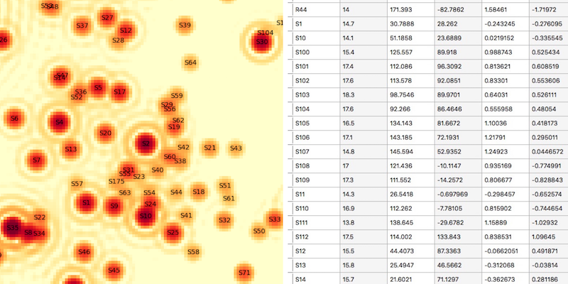

# Galactic Center Mock Images

Generate mock images of the S-star cluster at any particular time, based on the long term-monitoring of individual stellar motions.



Examples ([data file](https://github.com/pmplewa/GCdb/blob/master/data/stars.ndjson)):
```
python mockimg.py -h
```
```
python mockimg.py -t 2018.3 -d stars.ndjson -o image.fits
```
```
python mockimg.py -t 2018.3 -d stars.ndjson -o image.fits --preview
```
```
>>> from mockimg import gen_image
>>> image_hdu, table_hdu = gen_image(2018.3)
```
